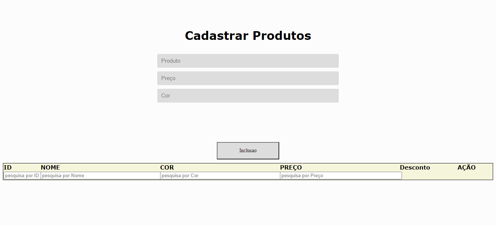
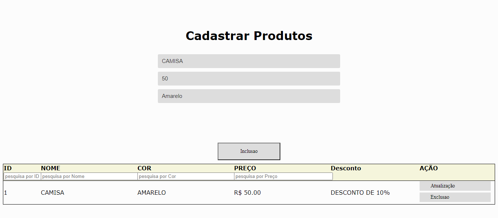
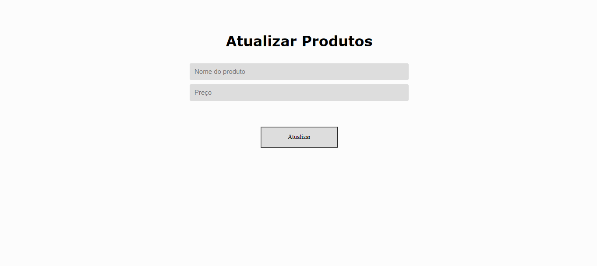
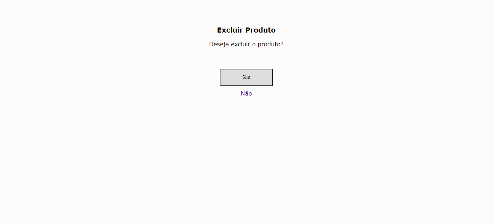

<h1 align="center">
  Desafio Titan
</h1>

   Criado por 
    <a href="https://github.com/TiagoSilva-Dev">Tiago Silva
  

# 📌 Conteudo

* [Screenshots](#camera-screenshots)
* [Objetivo](#computer-Objetivo)

# :camera: Screenshots

   
   
    
   

# :rocket: Technologies
This project was made using the follow technologies:

- [PHP](https://www.php.net/)

# :computer: Objetivo
Crie uma página com dois campos PRODUTOS, PREÇOS, COR.
Crie botões de INSERÇÃO, ATUALIZAÇÃO e de EXCLUSÃO.
Monte uma tabela (HTML) para Listar os Produtos.
Bônus: Crie um Filtro Básico para a página.
Filtrar por Nome
Filtrar por Cor. Em um campo de SELECT.
Filtrar por preço. Quando for MAIOR, MENOR OU IGUAL.

